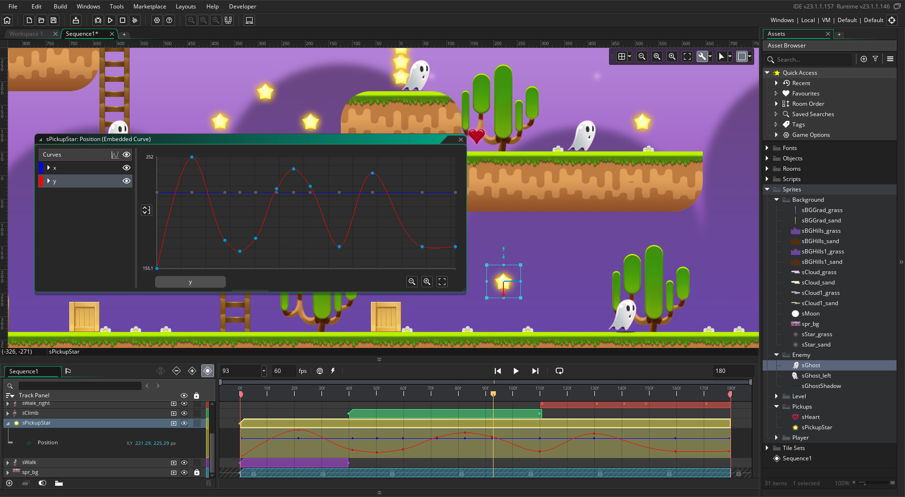

# Jump-and-Run

### Mit Game Maker
 

GameMaker ist ein Programm, mit dem man Spiele ohne viel Programmier-Erfahrung machen kann. Es hat eine einfache Bedienung, bei der man mit der Maus Sachen hin- und herschiebt und es hat auch eine eigene Sprache namens GML, mit der man Regeln für das Spiel aufstellen kann. Mit GameMaker kann man Spiele für verschiedene Computer und Handys machen.

